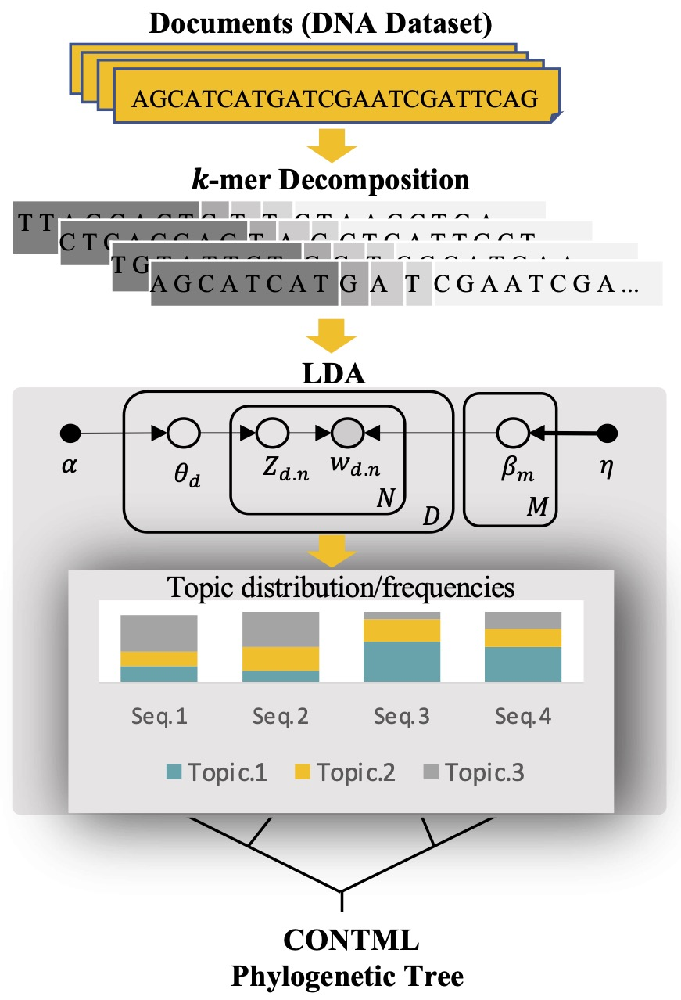

<div align="center"></div>

<br/> 

<h1 align="center">
$\large{\color{purple}{\textbf{TopicContml}}}$
</h1>

Python package **TopicContml** uses $k$-mers and probabilistic topic modeling, an unsupervised machine learning approach based on natural language processing, to construct evolutionary relationships among multilocus species from aligned/unaligned DNA sequences.

## Table of Contents
- **[Usage](#Usage)**
- **[Arguments](#Arguments)**
- **[Installation and Requirements](#Installation-and-Requirements)**
- **[Application to Datasets](#Application-to-Datasets)**
- **[Bootstrap Analysis](#Bootstrap-Analysis)**
- **[License](#License)**
- **[Citing TopicContml](#Citing-TopicContml)**


## Usage

    topiccontml.py [-h] [-e] [-gt GAPS_TYPE] [-m MERGING] [-k KMERS] [-kt KMER_TYPE] 
                    [-f FOLDER][-nl NUM_LOCI] [-nb NUM_BOOTSTRAP] [-bt BOOTSTRAP_TYPE] 
                    [incl INCLUDE_FILE] [excl EXCLUDE_FILE][-force] [-show] [-tmap] 
                    [-threads] [-amb AMBIGUOUG_LETTERS]
                    [-nt NUM_TOPICS] [-cr COHERENCE_RANGE] [-i ITERATIONS] [-p PASSES] 
                    [-cs CHUNKSIZE] [-ee EVAL_EVERY] [-ue UPDATE_EVERY] [-al ALPHA] [-et ETA]
                    [-fb FILTER_BELOW] [-fa FITER_ABOVE]
                        


## Arguments

**-h, --help**
> Show this help message and exit.  

<br/>

**-e, --extended**
> Indicates that the PHYLIP dataset is in the extended format. Use this option if your dataset uses the extended format, but note that individual names are still limited to a maximum of 10 characters.
 
<br/>

**-gt GAPS_TYPE, --gaps_type GAPS_TYPE**
> Specifies how gaps (-) in the sequence data should be handled. If set to "rm_row", gaps are removed within each sequence row, meaning gaps in individual sequences are stripped out. If set to "rm_col", columns (sites) containing at least one gap in any sequence are entirely removed from the dataset. If this option is not provided, gaps are included in the analysis by default.

<br/>

**-m MERGING, --merging MERGING**
> Specifies the number of leading characters (m) to consider when merging sequences. Sequences that share the same first m characters are combined into a single sequence. This option is typically used for grouping sequences based on population or species labels. If not specified, no merging occurs.

<br/>

**-kr KMERS, --kmers KMERS**
> Specifies the k-mer length(s) to use in processing. If you use -k kmer_value, the program processes with that specific k-mer length. If you provide -k min,max,step, the program considers a range of k-mer lengths starting from min to max with the given step. For example, -k 2,10,2 results in k-mer lengths of 2, 4, 6, and 8. If you use -k without any value, it defaults to the range 2,10,2. If the -k option is omitted entirely, the program determines an optimal k-mer length for document, which is our recommendation.

<br/>

**-kt KMER_TYPE, --kmer_type KMER_TYPE**
> Specifies how k-mers are extracted from the sequences. The default value is "not_overlap", which extracts k-mers without overlaps. If set to "overlap", k-mers are extracted with overlapping.

<br/>

**-f FOLDER, --folder FOLDER**
> Specifies the folder containing the loci data. The folder should include separate text files named in the format locus0.txt, locus1.txt, and so on.

<br/>

**-nl NUM_LOCI, --num_loci NUM_LOCI**
> Specifies the number of loci to process. The default value is 1.

<br/>

**-nb NUM_BOOTSTRAP, --num_bootstrap NUM_BOOTSTRAP**
> Specifies the number of bootstrap replicates to perform. The default value is 0.

<br/>

**-bt BOOTSTRAP_TYPE, --bootstrap_type BOOTSTRAP_TYPE**
> Specifies the type of bootstrap method to use. The default is "kmer", which selects x k-mers randomly from each document of x k-mers. Use "seq" to select x columns randomly from aligned sequences of the same length. Note that "seq" works only if all sequences have the same length.

<br/>

**-incl INCLUDE_FILE, --include INCLUDE_FILE**
> Specifies a file containing a list of names to be included in the analysis.

<br/>

**-excl EXCLUDE_FILE, --exclude EXCLUDE_FILE**
> Specifies a file containing a list of names to be excluded from the analysis.

<br/>

**-force , --force**
> Forces the inclusion of all species by using an uninformative topic frequency for any missing data.

<br/>

**-show , --showtree**
> Displays the tree using FigTree.

<br/>

**-tmap**
> Uses pyLDAvis to visualize and map the topics.

<br/>

**-threads**
> Specifies the number of CPU cores to use for locus-parallel runs. The default is the maximum number of cores available on the system.

<br/>

**-amb , --ambiguous_letters**
> Specifies ambiguous letters to be removed. K-mers containing these letters are filtered out before analysis. If -amb is used without specifying letters, the default set (n,N,?) is applied. To provide a custom set, pass the desired letters as an argument (e.g., -amb N,\?, -).

<br/>

**-nt NUM_TOPICS, --num_topics NUM_TOPICS**
> Specifies the number of latent topics to extract from the training corpus. The default value is 5.

<br/>

**-cr COHERENCE_RANGE, --coherence_range COHERENCE_RANGE**
> Specifies a range to compute coherence for different numbers of topics, given as [start, limit, step]. If -cr is used without specifying a range, the default is 2,20,4, which computes coherence for topic numbers 2, 6, 10, 14, and 18.

<br/>

**-i ITERATIONS, --iterations ITERATIONS**
> Specifies the maximum number of iterations through the corpus when inferring the topic distribution. The default value is 1000 iterations.

<br/>

**-p PASSES, --passes PASSES**
> Number of passes through the corpus during training. Defult value is 50.

<br/>

**-cs CHUNKSIZE, --chunksize CHUNKSIZE**
> Number of documents to be used in each training chunk. Defult value is 2000..

<br/>

**-ee EVAL_EVERY, --eval_every EVAL_EVERY**
> Log perplexity is estimated every that many updates. Defult value is 1.

<br/>

**-ue UPDATE_EVERY, --update_every UPDATE_EVERY**
> Number of documents to be iterated through for each update. Defult value is 5.

<br/>

**-al ALPHA, --alpha ALPHA**
> A priori belief on document-topic distribution. It can be: (1) scalar for a symmetric prior over document-topic distribution, (2) 1D array of length equal to num_topics to denote an asymmetric user defined prior for each topic. (3) Alternatively default prior strings:"symmetric": a fixed symmetric prior of 1.0 / num_topics,"asymmetric": a fixed normalized asymmetric prior of 1.0 / (topic_index + sqrt(num_topics)),"auto":Learns an asymmetric prior from the corpus.

<br/>

**-et ETA, --eta ETA**
> A priori belief on topic-word distribution. It can be: (1) scalar for a symmetric prior over  topic-word distribution, (2) 1D array of length equal to num_words to denote an asymmetric user defined prior for each word, (3) matrix of shape (num_topics, num_words) to assign a probability for each word-topic combination. (4) Alternatively default prior strings:"symmetric": a fixed symmetric prior of 1.0 / num_topics,"auto": Learns an asymmetric prior from the corpus.

<br/>

**-fb FILTER_BELOW, --filter_below FILTER_BELOW**
> Filter out tokens that appear in less than filter_below documents (absolute number) . Defult value is 2.

<br/>

**-fa FILTER_ABOVE, --filter_above FILTER_ABOVE**
> Filter out tokens that appear in more than filter_above documents (fraction of total corpus size, not absolute number). Defult value is 0.5.

> <br/>

## Installation and Requirements

* you most likely will need to install several **packages** for example: <br/>
1. `gensim` (for topic modeling):
    ```
    conda install gensim       
    ```
   This should also trigger the installation of numpy and scipy.
   
   For more information, see link <a html="https://radimrehurek.com/gensim/index.html">https://radimrehurek.com/gensim/index.html</a>
   
2. `dendropy`(for bootstrapping):
    ```
    conda install -c bioconda dendropy
    ```
    For more information, see link  <a html="https://dendropy.org/">https://dendropy.org/</a>
3. `matplotlib` (for visualization):
    ```
    conda install matplotlib
    ```
4. Additional dependencies:
    ```
    conda install numpy scipy pandas pyldavis
    ```
* **`CONTML`**:You will need to compile a customized version of `CONTML`, we call it `CONTML2` because if you want to run bootstrap the standard contml may fail if two individuals have the same frequencies, the custom version allows for that, it also uses a default of 15 characters for the individual names. We suggest that you create bin directory in your homedirectory and place the binaries there. The full Phylip version is here: <a html="https://phylipweb.github.io/phylip/">https://phylipweb.github.io/phylip/</a>
    > Go into the directory <yourpath> of TopicContml. Use this commandline snippet to compile the custom version of Contml:
    > ```
    > cd  <yourpath>/TopicContml/
    > unzip phylip-part-3.69.zip
    > cd phylip-part-3.69/src
    > make contml
    > ```
    > $\normalsize{\color{grey}{\textsf{If this fails you will need to see whether you can use one of the makefiles supplied using:}}}$
    > ```
    > make -f makefile... contml
    > ```
    > $\normalsize{\color{grey}{\textsf{If that fails talk to someone to help compile a C program for your computer.}}}$
    >
    > You may need to use this once:
    > ```
    > cp contml ~/bin/contml2
    > ```
    > If ~/bin does not exist then do:
    > ```
    > mkdir -p ~/bin
    > ```
  
* **`FigTree`**: If you do not have figtree on your computer we suggest to install figtree so that you can call it from the commandline.
    > - Download Figtree from here <a html="https://github.com/rambaut/figtree/releases">https://github.com/rambaut/figtree/releases</a> <br/>
    > - Install figtree (on macs move figtree.app to the /Application folder) <br/>
    > - create a script 'figtree' with this content: <br/>
    > !/bin/sh <br/>
    > in the distribution of figtree is a also a jar file perhaps you simply put that somewhere and reference it here, or then use something like below that uses te jarfile from the application java -Xms64m -Xmx512m -jar /Applications/FigTree\ v1.4.4.app/Contents/Resources/Java/figtree.jar $*
    > - move that figtree into your ~/bin folder and make sure figtree is executable, for example:
    > chmod +x ~/bin/figtree

* After cloning the repository, in `topiccontml.py` modify the `PROGRAMPATH` to the path that FigTree and CONTML are installed.

* TopicContml was tested on a Mac, Linux will be very similar. It will not work for Windows, but let us know.
  
* If you use python through anaconda, miniconda, or conda, we suggest that you create a virtual environment to run it:
    ```
    conda env create -n topicconml python=3.8    
    conda activate topiccontml  
    ```
    $\normalsize{\color{grey}{\textsf{if this fails follow the instructions on the screen}}}$
* Now you should be ready to try a test case:
    ```
    python <yourpath>/TopicContml/topiccontml.py -f testdata -nl 3
    ```


<br/>

## Application to Datasets

### Dataset of Loci
> The  dataset of sequences should be in the directory in a folder. Inside the folder, loci should be in separate text files called "`loci0.txt`", "`loci1.txt`", .... that follow the Phylip syntax.
>  Each locus text file should have the following basic structure:
> ```
> ntax nchar 
> labels + sequences
> ```

### Dataset of FASTA Files
> * **Unassemblede Reads**
>> If you have unassembled FASTA read files, you first need to generate the specified number of loci (n) using the provided loci.py script.
>> For example, in our study, the PacBio dataset contained 100,000 reads for each of 12 species in the folder pacbio_reads. We generated a loci folder pacbio_loci with 100 loci using the following command:
>>```
>>python loci.py -fr 100 -if pacbio_reads -of pacbio_loci
>>```
>>Then we generted phylogenetic tree using:
>> ```
>> python topiccontml.py -k 20 -nl 100 -i 500 -f pacbio_loci -threads 1
>> ```
> * **Complete Genome**
>> If you have complete genome FASTA files, you first need to generate the specified number of loci (n) using the loci.py script.
>> For example, in our study, we had 59 complete genomes from the Ebola virus stored in the folder ebola_genomes. We generated one locus
>> from these genomes in the output folder ebola_loci using the following command: 
>>```
>>python loci.py -fg 1 -if ebola_genomes -of ebola_loci
>>```


<br/>


## Bootstrap Analysis

### TopicContml Bootstrap
Consider the provided dataset "loci_birds". we apply TopicContml to do bootstrapping using 1000 bootstrap replicates. It gerenerates the majority-rule consensus trees (output `bootstrap_majority.tre`).<br/> 
> * **Aligned Dataset:** 
> ```
> python topiccontml.py -e -f loci_birds -m 3 -nl 14 -nb 1000 -al 1 -show
> ```
> As you noticed, in each locus, we merge the words from the same location (using 3 first letters) and then apply LDA.
>
> * **Unaligned Dataset:** 
> ```
> python topiccontml.py -e -f loci_birds -m 3 -nl 14 -nb 1000 -al 1 -gt rm_row -show    
> ```


### SVDquartets Bootstrap
we apply SVDquartets to the aligned dataset using 1000 bootstrap replicates and report the majority-rule consensus tree (output `svdq_tree`).
> 1. From the loci folder we generate concatenated NEXUS file of sequences called "`myfile.nex`". For the missing sequences in loci we are adding `?` for that sequence in the NEXUS file:
>   ```
>   python nexus.py -e -nl 14 -t total -m 3 -s birdspecies -w myfile -f loci_birds
>   ```
> 2. Use "myfile.nex" as an input in `PAUP` to get the the SVDquartets bootstrap tree called "`svdq_tree`":
> TopicContml> paup  <br/>
> paup> ```exe myfile.nex```  <br/>
> paup> ```svdq partition=birdspecies showScores=no seed=1234568 bootstrap nreps=1000```  <br/>
> paup> ```savetrees file=svdq_tree format=altnex```  <br/>


## License 
TopicContml is licensed under a [MIT License](https://github.com/TaraKhodaei/TopicContml/blob/main/LICENSE) :balance_scale:

## Citing TopicContml

If you use TopicContml software for publications, please cite this:

    Khodaei, M., Edwards, S., and Beerli, P. (2023). Multilocus phylogeny estimation using
        probabilistic topic modeling, bioRxiv doi: https://doi.org/10.1101/2023.12.20.572577  
                            

