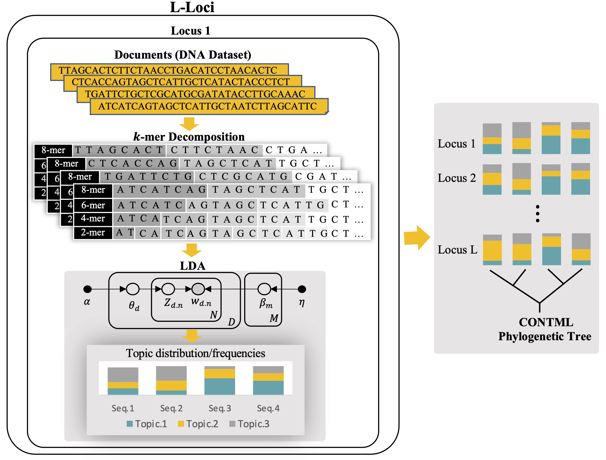
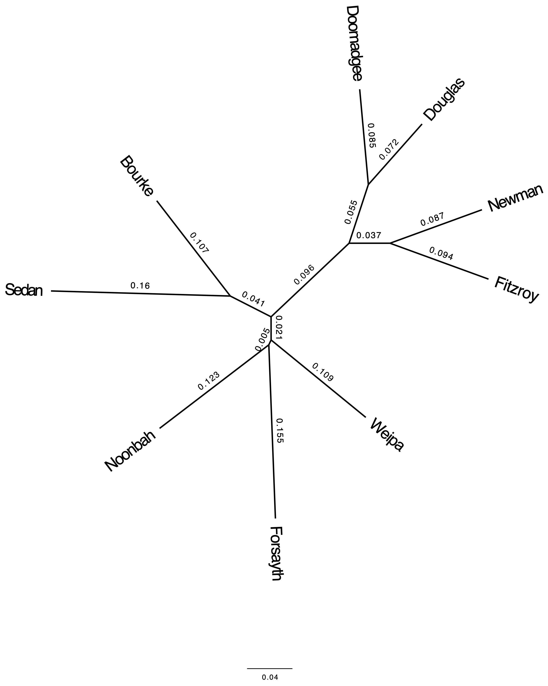

<div align="center"></div>

<br/> 

<h1 style="text-align: center;">$\huge{\color{purple}{\textbf{TopicContml}}}$</h1>

<h1 style="text-align: center;">TopicContml</h1>


Python package **TopicContml** uses $k$-mers and probabilistic topic modeling, an unsupervised machine learning approach based on natural language processing, to construct evolutionary relationships among multilocus species from unaligned DNA sequences.

## Table of Contents
- **[Usage](#usage)**
- **[Arguments](#Arguments)**


## Usage

    topiccontml.py [-h] [-e] [-gt GAPS_TYPE] [-m MERGING] [-kr KMER_RANGE] [-kt KMER_TYPE] 
                    [-f FOLDER] [-nf NEXUS_File] [-nl NUM_LOCI] [-sd SIM_DIVERGE] 
                    [-nb NUM_BOOTSTRAP] [-bt BOOTSTRAP_TYPE] [incl INCLUDE_FILE] 
                    [excl EXCLUDE_FILE] [-force] [-show]
                    [-nt NUM_TOPICS] [-i ITERATIONS] [-p PASSES] [-cs CHUNKSIZE] 
                    [-ee EVAL_EVERY] [-ue UPDATE_EVERY] [-al ALPHA] [-et ETA]  
                        


## Arguments

**-h, --help**
> Show this help message and exi  

<br/>

**-e, --extended**
> If the phylip dataset is in the extended format, use this. 
 
> <br/>

**-gt GAPS_TYPE, --gaps_type GAPS_TYPE**
> String "rm_row": removes gaps(-) in each sequence by the row. String "rm_col": romoves the column if there is at least one gap(-) in that column. Otherwise, it does not make changes in sequences.

<br/>

**-m MERGING, --merging MERGING**
> Merge sequences that start with the same number of MERGING letters.

<br/>

**-kr KMER_RANGE, --kmer_range KMER_RANGE**
> Range of kmers extraction, lowerbound,max+1,step [for example: 2,10,2 leads to non overlapping k-mers: 2,4,6,8']

<br/>

**-kt KMER_TYPE, --kmer_type KMER_TYPE**
> Default "not_overlap": extract kmers without overlapping. String "overlap": extract kmers with overlapping.

<br/>

**-f FOLDER, --folder FOLDER**
> The folder that contains loci data in separate text files called "locus0.txt", "locus1.txt", ...

<br/>

**-nf NEXUS_File, --nexus_file NEXUS_File**
> The NEXUS file that contains the multiloci data.

<br/>

**-nl NUM_LOCI, --num_loci NUM_LOCI**
> Number of loci

<br/>

**-sd SIM_DIVERGE, --siminfile_diverge_time SIM_DIVERGE**
> To do siminfile analysis for the folder with the given float number of sim_diverge

<br/>


**-nb NUM_BOOTSTRAP, --num_bootstrap NUM_BOOTSTRAP**
> Number of bootstrap replicates

<br/>

**-bt BOOTSTRAP_TYPE, --bootstrap_type BOOTSTRAP_TYPE**
> Default "kmer": do the bootstrap by randomly choosing  x kmers in each document of x kmers. String "seq": do the bootstrap by randomly choosing  x columns  of aligned sequences with the same length of x ("seq" works only in the case the sequences have the same lengths)

<br/>

**-incl INCLUDE_FILE, --include INCLUDE_FILE**
> The include file contains a list of names that must be analyzed

<br/>

**-excl EXCLUDE_FILE, --exclude EXCLUDE_FILE**
> The exclude file contains a list of names that should not be analyzed

<br/>

**-force , --force**
> This forces to use all species using an uninformative topicfrequency for missings

<br/>

**-show , --showtree**
> Uses figtree to show the tree

<br/>

**-nt NUM_TOPICS, --num_topics NUM_TOPICS**
> Number of topics. Defult value is 5 topics.

<br/>

**-i ITERATIONS, --iterations ITERATIONS**
> Maximum number of iterations through the corpus when inferring the topic distribution of a corpus. Defult value is 1000 iterations.

<br/>

**-p PASSES, --passes PASSES**
> Number of passes through the corpus during training. Defult value is 50.

<br/>

**-cs CHUNKSIZE, --chunksize CHUNKSIZE**
> Number of documents to be used in each training chunk. Defult value is 20.

<br/>

**-ee EVAL_EVERY, --eval_every EVAL_EVERY**
> Log perplexity is estimated every that many updates. Defult value is 1.

<br/>

**-ue UPDATE_EVERY, --update_every UPDATE_EVERY**
> Number of documents to be iterated through for each update. Defult value is 5.

<br/>

**-al ALPHA, --alpha ALPHA**
> A priori belief on document-topic distribution. It can be: (1) scalar for a symmetric prior over document-topic distribution, (2) 1D array of length equal to num_topics to denote an asymmetric user defined prior for each topic. (3) Alternatively default prior strings:"symmetric": a fixed symmetric prior of 1.0 / num_topics,"asymmetric": a fixed normalized asymmetric prior of 1.0 / (topic_index + sqrt(num_topics)),"auto":Learns an asymmetric prior from the corpus

<br/>

**-et ETA, --eta ETA**
> A priori belief on topic-word distribution. It can be: (1) scalar for a symmetric prior over  topic-word distribution, (2) 1D array of length equal to num_words to denote an asymmetric user defined prior for each word, (3) matrix of shape (num_topics, num_words) to assign a probability for each word-topic combination. (4) Alternatively default prior strings:"symmetric": a fixed symmetric prior of 1.0 / num_topics,"auto": Learns an asymmetric prior from the corpus.

<br/>


$\huge{\color{purple}{\textsf{Requirements}}}$

* The following **packages** are required: <br/>
1. `gensim`:
    ```
    pip install gensim
    ```
2. `CONTML` You will need to compile a customized version of `CONTML`, we call it `CONTML2` because if you want to run bootstrap the standard contml may fail if two individuals have the same frequencies, the custom version allows for that, it also uses a default of 15 characters for the individual names. We suggest that you create bin directory in your homedirectory and place the binaries there. The full Phylip version is here: <a html="https://evolution.genetics.washington.edu/phylip.html">https://evolution.genetics.washington.edu/phylip.html</a>

    ```
    #use this commandline snippet to compile the custom version of contml
    cd phylip-part-3.69/src
    make contml
    # you may need to use this once: mkdir -p ~/bin
    cp contml ~/bin/contml2
    ```
3. `FigTree`, download Figtree from here <a html="https://github.com/rambaut/figtree/releases">https://github.com/rambaut/figtree/releases</a>
* After cloning the repository, in `topiccontml.py` modify the `PROGRAMPATH` to the path that FigTree and CONTML are installed.


<br/>


$\huge{\color{purple}{\textsf{Application to Datasets}}}$

$\large{\color{purple}{\textsf{Real Dataset}}}$
> The bird sequences are collected from 14 loci and 9 different locations. For each locus, the length of each sequence varies from 288 to 418 base pairs, and the number of sequences varies from 78 to 92 individuals. <br/>
>
> * **loci Folder**<br/>
>> In this case, the dataset of sequences are in a folder (e.g. "loci_birds"). <br/>
    In each locus, we merge the words from the same location (e.g. using 3 first letters) and then apply LDA.
>> ```
>> python topiccontml.py -f loci_birds -m 3 -gt rm_row -nl 14 -show
>> ```
>> <div align="center"></div>
>> 
>> **$\color{orange}{\textsf{NOTE}}$** <br/>
>> The  dataset of sequences should be in the directory in a folder. Inside the folder, loci should be in separate text files called "`loci0.txt`", "`loci1.txt`", .... that follow the Phylip syntax.
>>  Each locus text file should have the following basic structure:
>> ```
>> ntax nchar 
>> labels + sequences
>> ```
>
> * **NEXUS file**<br/> 
>> In this case, the dataset of sequences are in a NEXUS file (e.g. "myfile.nex"). 
>> ```
>> python topiccontml.py -nf myfile.nex -m 3 -gt rm_row -nl 14 -show
>> ```
>> 
>> **$\color{orange}{\textsf{NOTE}}$** <br/>
>>  NEXUS file and blocks should have the following basic structure:
>> ```
>> #nexus
>> 
>> begin data;
>>       dimensions ntax=... nchar=...;
>>       format datatype=dna missing=? gap=-;
>>       matrix
>> labels + sequences
>> ;
>> end;
>> begin sets;
>>       charpartition ...
>> end;
>> begin sets;
>>       taxpartition ...
>> end;
>> ```


$\large{\color{purple}{\textsf{Simulated Dataset}}}$
> ```
> python topiccontml.py -f sim_100_0.0_100 -sd 0.0 -m 3 -gt rm_row -nl 100
> python topiccontml.py -f sim_100_0.01_100 -sd 0.01 -m 3 -gt rm_row -nl 100
> python topiccontml.py -f sim_100_0.05_100 -sd 0.05 -m 3 -gt rm_row -nl 100
> python topiccontml.py -f sim_100_0.1_100 -sd 0.1 -m 3 -gt rm_row -nl 100
> python topiccontml.py -f sim_100_0.2_100 -sd 0.2 -m 3 -gt rm_row -nl 100
> ```

<br/>


$\huge{\color{purple}{\textsf{Bootstrap Analysis}}}$

$\large{\color{purple}{\textsf{TopicContml Bootstrap}}}$<br/>
we apply TopicContml to the aligned dataset using 1000 bootstrap replicates and report the majority-rule consensus trees (output `bootstrap_majority.tre`). We also map the bootstrap replicates onto the best topology tree found by TopicContml as the reference tree  (output `bootstrap_target_best.tre`).<br/>
We do the same bootstrap analysis to the unaligned dataset. 
> * **Aligned Dataset:**
>> Loci Folder
>> ```
>> python topiccontml.py -f loci_birds -m 3 -nl 14 -nb 1000 -show
>> ```
>> Nexus File
>> ```
>> python topiccontml.py -nf myfile.nex -m 3 -nl 14 -nb 1000 -show
>> ```
> * **Unaligned Dataset:**
>> Loci Folder
>> ```
>> python topiccontml.py -f loci_birds -m 3 -gt rm_row -nl 14 -nb 1000 -show
>> ```
>> Nexus File
>> ```
>> python topiccontml.py -nf myfile.nex -m 3 -gt rm_row -nl 14 -nb 1000 -show
>> ```


$\large{\color{purple}{\textsf{SVDquartets Bootstrap}}}$<br/>
we apply SVDquartets to the aligned dataset using 1000 bootstrap replicates and report the majority-rule consensus tree (output `svdq_tree`).
> 1. From the loci folder we generate concatenated NEXUS file of sequences called "`myfile.nex`". For the missing sequences in loci we are adding `?` for that sequence in the NEXUS file:
>   ```
>   python nexus.py -e -nl 14 -t total -m 3 -s birdspecies -w myfile -f loci_birds
>   ```
> 2. Use "myfile.nex" as an input in `PAUP` to get the the SVDquartets bootstrap tree called "`svdq_tree`":
> TopicContml> paup  <br/>
> paup> ```exe myfile.nex```  <br/>
> paup> ```svdq partition=birdspecies showScores=no seed=1234568 bootstrap nreps=1000```  <br/>
> paup> ```savetrees file=svdq_tree format=altnex```  <br/>


