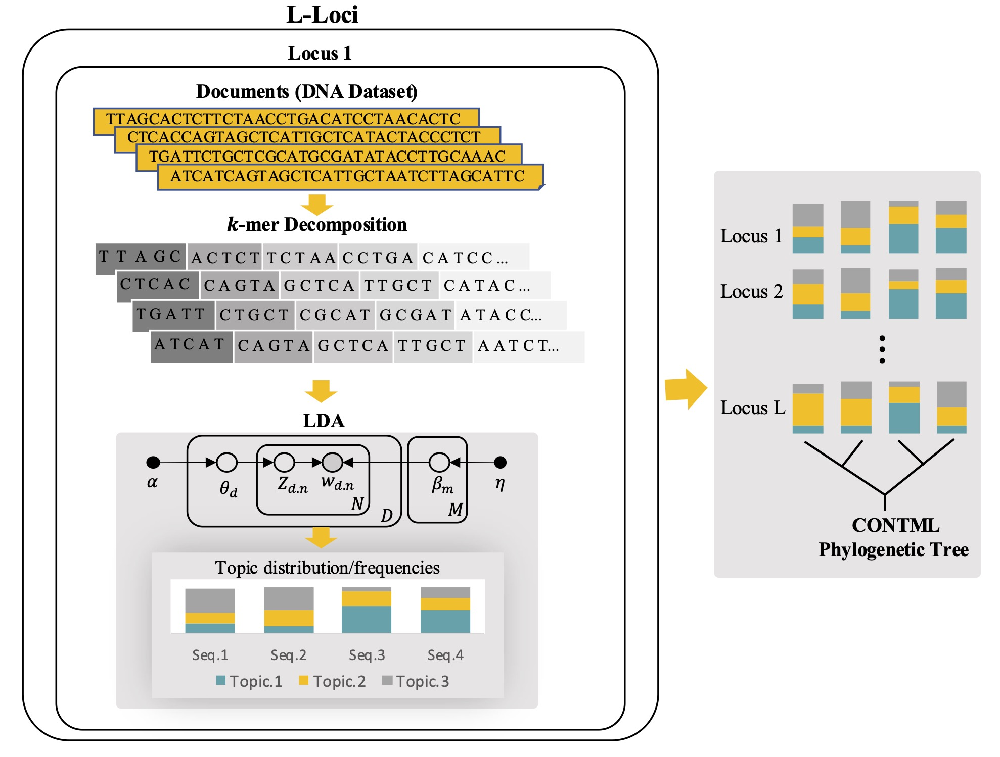

<div align="center"></div>

Python package **TopicContml** uses $k$-mers and probabilistic topic modeling, an unsupervised machine learning approach based on natural language processing, to construct evolutionary relationships among species from unaligned DNA sequences.


# $\color{purple}{\textsf{Usage}}$
    topiccontml.py [-h] [-e] [-m] [-gt GAPS_TYPE] [-kt KMER_TYPE] [-kr KMER_RANGE] [-n NUM_LOCI] 
                        

# $\color{purple}{\textsf{Arguments}}$

**-h, --help**
> show this help message and exi  

<br/>

**-e, --extended**
> If the phylip dataset is in the extended format, use this. 
 
> <br/>

**-m, --merging**
> It merges sequences with the same population

<br/>

**-gt GAPS_TYPE, --gaps_type GAPS_TYPE**
> String "rm_row": removes gaps(-) in each sequence by the row. String "rm_col": romoves the column if there is at least one gap(-) in that column. Otherwise, it does not make changes in sequences.

<br/>

**-kt KMER_TYPE, --kmer_type KMER_TYPE**
> default "not_overlap": extract kmers without overlapping. String "not_overlap": extract kmers with overlapping.

<br/>

**-kr KMER_RANGE, --kmer_range KMER_RANGE**
> range of kmers extraction (default range is 2,10,2, which means it creates words with lengths 2, 4, 6, and 8).

<br/>

**-n NUM_LOCI, --num_loci NUM_LOCI**
> number of loci

<br/>


# $\color{purple}{\textsf{Requirements}}$
* The following **packages** are required: <br/>
1. `gensim`:
    ```bash
    pip install gensim
    ```
* The  **dataset** of sequences should be in the directory in a folder, including loci in separate text files called **"loci0.txt", "loci1.txt", ...**
`

<br/>


# $\color{purple}{\textsf{Application to Real Data}}$

## $\color{purple}{\textsf{1. First Dataset : Birds}}$

> **Experiment 1.1**.<br/>
> > **loci_birds:** The bird sequences are collected from 14 loci and 9 different locations. For each locus, the length of each sequence varies from 288 to 418 base pairs, and the number of sequences varies from 78 to 92 individuals.
> ```
> python TopicContml.py -e -m -gt rm_row -n 19
> ```
> <div align="center"></div>


